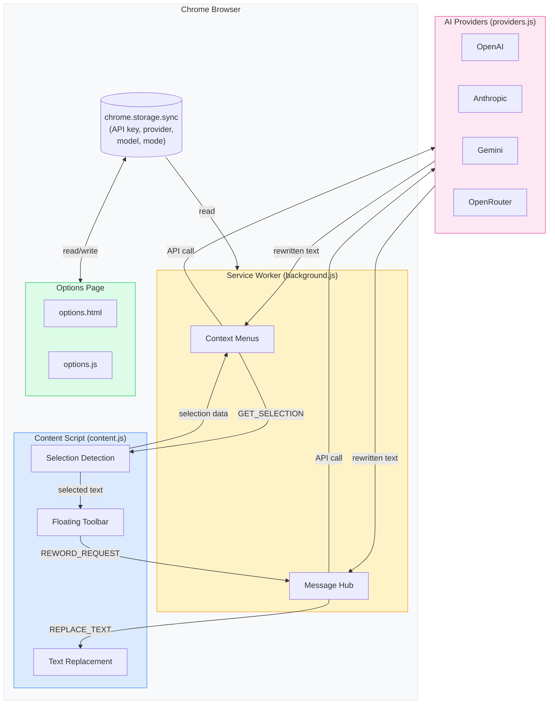

# Reword

A Chrome extension that rewrites selected text in editable fields using AI. Select, pick a mode, done.

Works on Gmail, Slack, Notion, Google Docs, LinkedIn, Twitter/X, and any website with editable text fields.

## How It Works

1. Select text in any editable field on any webpage
2. A floating toolbar appears — or right-click and choose **Reword**
3. Pick a rewrite mode and your text is replaced in-place

### Rewrite Modes

| Mode | What It Does |
|------|-------------|
| **Polish** | Fix grammar, spelling, and flow |
| **Formal** | Professional, business-appropriate tone |
| **Short** | Remove filler, keep it concise |
| **More** | Expand with detail and context |
| **Warm** | Friendly, personable tone with greetings |

## Architecture



### Message Flow

There are two ways to trigger a rewrite:

**Floating Toolbar** (click a mode button):
```
content.js ──REWORD_REQUEST──▶ background.js ──API call──▶ Provider
                                    │
content.js ◀──sendResponse─────────┘
    │
    └── replaces text in DOM
```

**Context Menu** (right-click > Reword > Mode):
```
background.js ──GET_SELECTION──▶ content.js
                                    │
background.js ◀── selection data ───┘
    │
    ├── API call ──▶ Provider
    │
    └── REPLACE_TEXT ──▶ content.js ──▶ replaces text in DOM
```

### File Structure

| File | Purpose |
|------|---------|
| `manifest.json` | MV3 config: permissions, service worker, content scripts |
| `background.js` | Service worker: context menus, API routing, message hub |
| `content.js` | Content script: selection detection, floating toolbar, text replacement |
| `content.css` | Floating toolbar styles (scoped with `#reword-` prefix) |
| `providers.js` | AI provider abstraction (OpenAI, Anthropic, Gemini, OpenRouter) |
| `prompts.js` | System prompts for each rewrite mode |
| `options.html/js/css` | Settings page (provider, API key, model, default mode) |
| `icons/` | Extension icons (16, 32, 48, 128px) |

## Supported Providers

| Provider | Default Model | Auth |
|----------|--------------|------|
| **OpenAI** | GPT-4o Mini | Bearer token |
| **Anthropic** | Claude Sonnet 4 | x-api-key header |
| **Google Gemini** | Gemini 2.0 Flash | Query parameter |
| **OpenRouter** | User-specified | Bearer token |

All requests go **directly from your browser to the provider**. No intermediary server.

## Setup

1. Clone this repo or download as ZIP
2. Open `chrome://extensions` in Chrome
3. Enable **Developer mode** (toggle in top-right)
4. Click **Load unpacked** and select this folder
5. Click the extension icon > **Settings** to add your API key

## Build for Chrome Web Store

```bash
bash build.sh
```

Creates `reword-extension.zip` ready for upload to the Chrome Web Store.

## Privacy

- No analytics, tracking, or data collection
- API key stored locally in Chrome's sync storage
- Text is only sent to your chosen AI provider when you trigger a rewrite
- [Full privacy policy](privacy-policy.html)

## License

MIT
