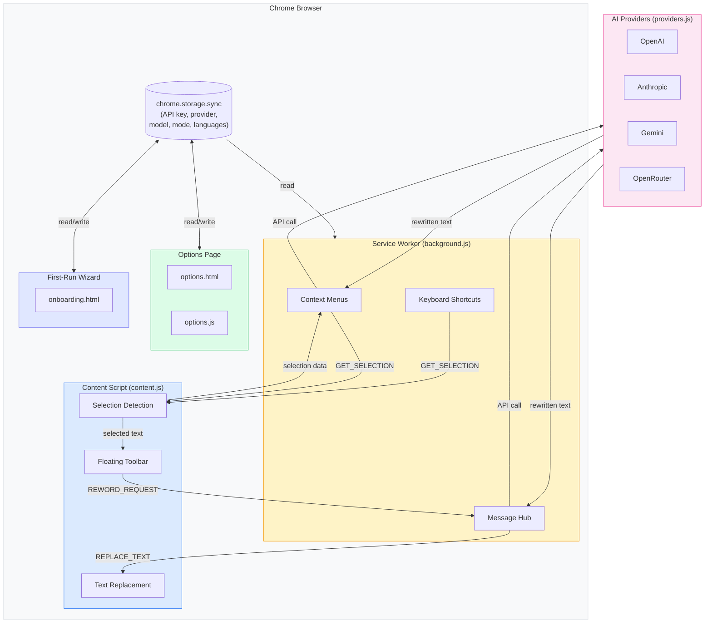

# Reword — AI Text Rewriter

A Chrome extension that rewrites, translates, and polishes selected text in editable fields using AI. Select, pick a mode, done.

Works on Gmail, Slack, Notion, Google Docs, LinkedIn, Twitter/X, and any website with editable text fields.

## How It Works

1. Select text in any editable field on any webpage
2. A floating toolbar appears — or right-click and choose **Reword**
3. Pick a rewrite mode and your text is replaced in-place

### Rewrite Modes

| Mode | What It Does |
|------|-------------|
| **Polish** | Fix grammar, spelling, and flow |
| **Formal** | Professional, business-appropriate tone |
| **Short** | Remove filler, keep it concise |
| **More** | Expand with detail and context |
| **Warm** | Friendly, personable tone with greetings |
| **Translate** | Translate to 15 languages |

### Keyboard Shortcuts

| Shortcut | Action |
|----------|--------|
| `Alt+R` (Windows/Linux) | Rewrite with default mode |
| `Control+Shift+R` (Mac) | Rewrite with default mode |
| `1` – `5` | Select mode when toolbar is visible |
| `Escape` | Dismiss toolbar |
| `Ctrl/Cmd+Z` | Undo last rewrite |

### Translation

Click the **Translate** button on the toolbar to open the language menu. Supports 15 languages: Arabic, Chinese, Dutch, French, German, Hindi, Italian, Japanese, Korean, Polish, Portuguese, Russian, Spanish, Swedish, and Turkish. Configure which languages appear in Settings.

### Undo

After any rewrite, an **Undo** pill appears for 6 seconds. Click it or press `Ctrl/Cmd+Z` to restore your original text with all formatting intact.

## Features

- **Formatting preservation** — Rewrites maintain bold, italic, and other rich text formatting in contenteditable fields
- **Request cancellation** — New requests automatically cancel in-flight ones, preventing stale results
- **Actionable errors** — API key errors show "Open Settings", transient errors show "Retry", all errors have a dismiss button
- **First-run onboarding** — 3-step setup wizard guides new users through provider and API key configuration
- **Context menu** — Right-click any editable field to access all rewrite modes and translation languages

## Architecture



### Message Flow

There are three ways to trigger a rewrite:

**Floating Toolbar** (click a mode button or press 1-5):
```
content.js ──REWORD_REQUEST──> background.js ──API call──> Provider
                                    |
content.js <──sendResponse──────────┘
    |
    └── replaces text in DOM, shows undo pill
```

**Context Menu** (right-click > Reword > Mode):
```
background.js ──GET_SELECTION──> content.js
                                    |
background.js <── selection data ───┘
    |
    ├── API call ──> Provider
    |
    └── REPLACE_TEXT ──> content.js ──> replaces text, shows undo pill
```

**Keyboard Shortcut** (Alt+R / Control+Shift+R):
```
background.js ──GET_SELECTION──> content.js
                                    |
background.js <── selection data ───┘
    |
    ├── API call (with default mode) ──> Provider
    |
    └── REPLACE_TEXT ──> content.js ──> replaces text, shows undo pill
```

### File Structure

| File | Purpose |
|------|---------|
| `manifest.json` | MV3 config: permissions, service worker, content scripts, keyboard shortcuts |
| `background.js` | Service worker: context menus, keyboard shortcuts, API routing, request cancellation |
| `content.js` | Content script: selection detection, floating toolbar, translate menu, undo, text replacement |
| `content.css` | Toolbar, translate menu, undo pill, and error state styles |
| `providers.js` | AI provider abstraction with abort signal support |
| `prompts.js` | System prompts for each rewrite mode + translate prompt template |
| `options.html/js/css` | Settings page (provider, API key, model, default mode, translation languages) |
| `onboarding.html/js/css` | First-run setup wizard (3 steps: welcome, configure, done) |
| `icons/` | Extension icons (16, 32, 48, 128px) |

## Supported Providers

| Provider | Default Model | Auth |
|----------|--------------|------|
| **OpenAI** | GPT-4o Mini | Bearer token |
| **Anthropic** | Claude Sonnet 4 | x-api-key header |
| **Google Gemini** | Gemini 2.0 Flash | Query parameter |
| **OpenRouter** | User-specified | Bearer token |

All requests go **directly from your browser to the provider**. No intermediary server.

## Setup

1. Clone this repo or download as ZIP
2. Open `chrome://extensions` in Chrome
3. Enable **Developer mode** (toggle in top-right)
4. Click **Load unpacked** and select this folder
5. The onboarding wizard will guide you through adding your API key

Or configure manually: click the extension icon > **Settings**.

## Build for Chrome Web Store

```bash
bash build.sh
```

Creates `reword-extension.zip` ready for upload to the Chrome Web Store.

## Privacy

- No analytics, tracking, or data collection
- API key stored locally in Chrome's sync storage
- Text is only sent to your chosen AI provider when you trigger a rewrite
- [Full privacy policy](privacy-policy.html)

## License

MIT
